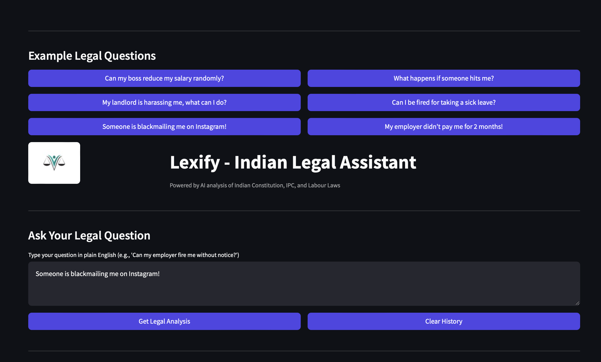
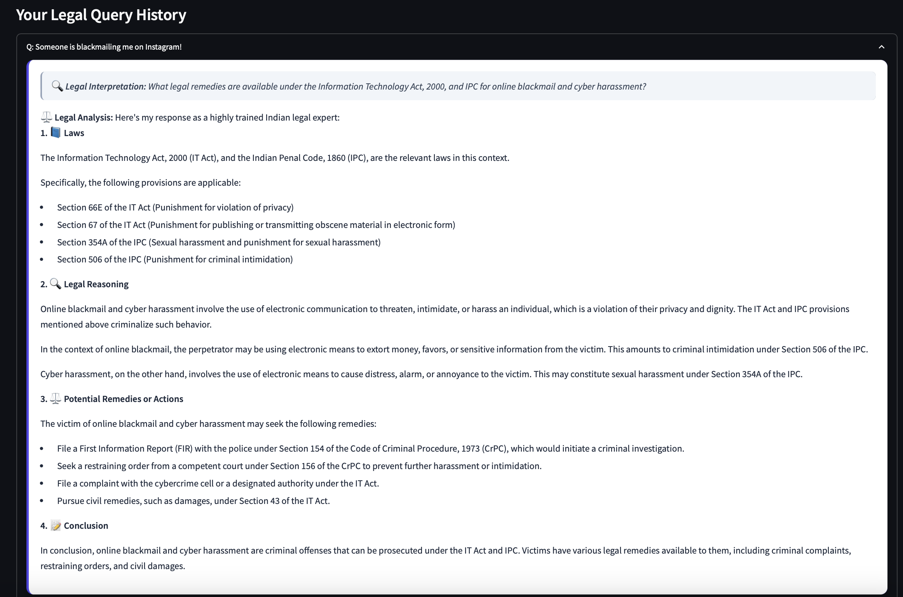
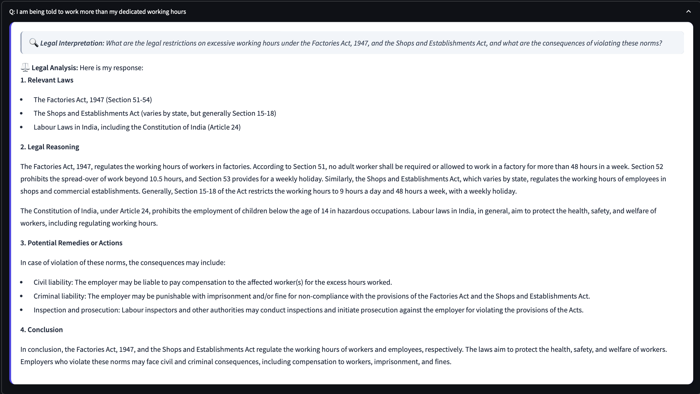

# ⚖️ Lexify - Indian Legal Assistant

**Lexify** is an AI-powered legal assistant built to help users understand Indian laws using simple, natural language queries. Whether you're concerned about employment rights, landlord disputes, cybercrime, or general legal protections, Lexify provides accessible legal insights based on key Indian statutes and laws.

---

## 📂 Features

- 🤖 **Ask legal questions in plain English**  
- 🧠 **Automatic query reformulation into formal legal language**  
- 📘 **Retrieves relevant Indian laws using vector search (Chroma + MiniLM embeddings)**  
- ⚖️ **Detailed legal reasoning and suggested actions**  
- 📝 **History of previous questions and answers**  
- 🎨 **Custom UI with styled components**  

---

## 🚀 How It Works

1. **User Input**: Ask a question like  
   _"Can my boss cut my salary anytime?"_

2. **LLM Reformulation**:  
   Reformulated to:  
   _"What are the legal provisions under Indian Labour Law regarding unauthorized salary deductions by employers?"_

3. **Vector Search**:  
   ChromaDB retrieves legal context from Indian laws.

4. **LLM Reasoning**:  
   Groq’s LLaMA 3-70B model analyzes and returns:
   - Relevant Laws  
   - Legal Reasoning  
   - Suggested Remedies or Actions  
   - Conclusion  

---

## 🛠️ Tech Stack

| Tool/Library             | Purpose                                      |
|--------------------------|----------------------------------------------|
| `Streamlit`              | Frontend UI                                  |
| `LangChain`              | LLM chaining and orchestration               |
| `ChromaDB`               | Vector database for legal document retrieval |
| `HuggingFace MiniLM`     | Sentence embeddings for search               |
| `Groq LLaMA 3-70B`       | Fast, cost-effective LLM                     |
| `dotenv`                 | Load API keys securely                       |
| `PIL (Pillow)`           | Load and display images                      |

---

## 📁 Project Structure

```
LEGALEASE/
│
├── app/
│ ├── VectoreStore/
│ ├── lexify.py # Main Streamlit app
│ ├── logo.jpg # Branding/logo
│ └── style.css # Custom Streamlit styling
│
├── chains/
│ └── query_groq.py # Reformulation & reasoning prompt templates
│
├── Documents/
│ ├── IndianConstitution.pdf
│ ├── IPC.pdf
│ └── Labour Act.pdf
│
├── images/
│ ├── ss1.png # Screenshot: Home Page
│ ├── ss2.png # Screenshot: Query 1 Analysis and Output
│ └── ss3.png # Screenshot: Query 2 Output and Output
│
├── loaders/
│ ├── store_embeddings.py
│ └── Text_Extraction.py
│
├── VectoreStore/chroma/
│ ├── b7489202-6668-... # Vector DB files
│ └── chroma.sqlite3
│
├── .env # Stores GROQ_API_KEY
└── README.md # Project documentation
```

---

## 🧪 Setup & Run Locally

### 1. Clone the Repository

```bash
git clone https://github.com/your-username/lexify-legal-assistant.git
cd lexify-legal-assistant
```

### 2. Create Virtual Environment

```bash
python -m venv venv
source venv/bin/activate  # On Windows use: venv\Scripts\activate
```

### 3. Install Dependencies

Create a `requirements.txt` with:

```txt
streamlit
langchain
langchain-groq
langchain-chroma
langchain-huggingface
python-dotenv
pillow
```

Then install:

```bash
pip install -r requirements.txt
```

### 4. Add API Key

Create a `.env` file in the root folder:

```ini
GROQ_API_KEY=your_groq_api_key_here
```

### 5. Run the App

```bash
streamlit run app.py
```

---

## 📸 Screenshots
### 🏠 Home Page

### Query 1

### Query 2

---

## ✅ Example Queries

Try asking:

- *My employer didn't pay me for 2 months*
- *Can I be fired for being sick?*
- *My landlord is threatening me*
- *Someone is blackmailing me on Instagram*

---

## 🧠 Future Improvements

- 🌐 Add multilingual support (e.g., Hindi, Tamil)  
- 📚 Integrate actual case law references  
- 📎 Enable legal document uploads for analysis  
- 📝 Export legal reports as PDFs  

---

## 👨‍⚖️ Disclaimer

**Lexify** is for informational purposes only. It **does not constitute legal advice**. Always consult a licensed advocate or legal professional for help with legal issues.

---
